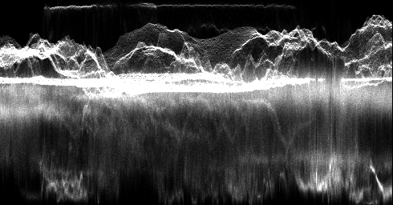
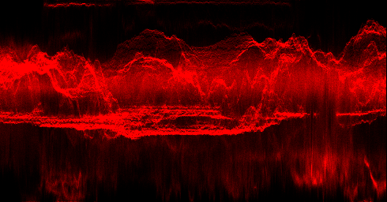
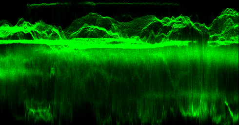
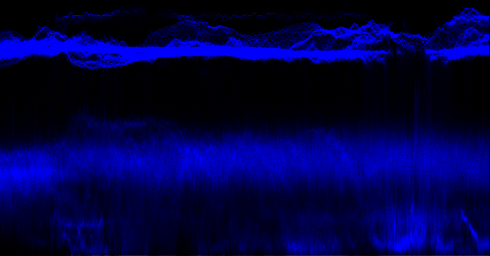

# Python-Color-Scopes
Python generated color scope plots based on input image, similar to Divinci Resolve color correction plots

The algorithm is built into a Jupyter Notebook that takes and example image and creates color scopes for Black and White, Red, Green, and Blue, as well as a combined waveform output.

A full description of the algorithm and my process of creating it can be found on my blog.

[Tea and Tech Time: Python Color Scopes](https://teaandtechtime.com/python-color-scopes/)

## Example

Test image

### Black and White

### RGB Parade

### Full Waveform
